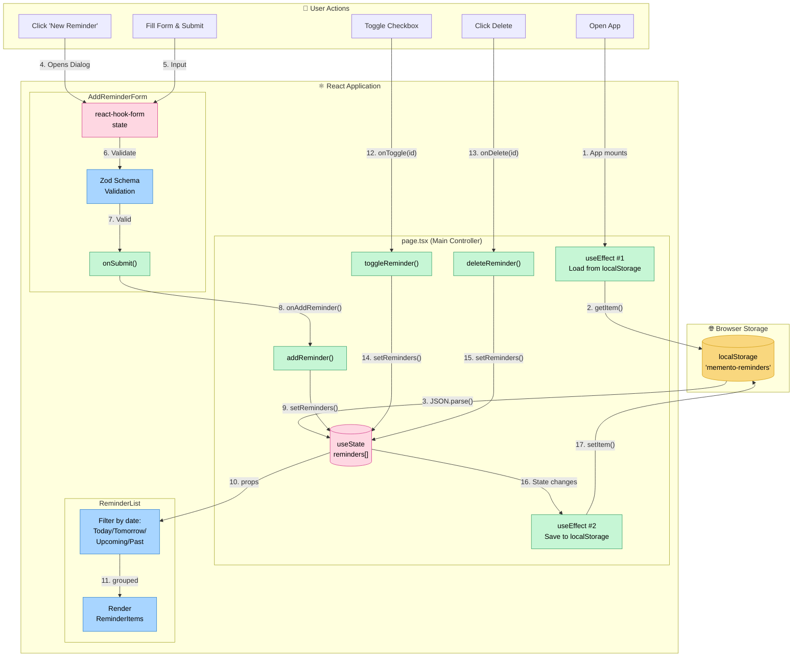

# Memento Daily - Data Flow Diagram

## Data Flow Summary

| Step | What Happens |
|------|--------------|
| **1-3** | App loads → Reads localStorage → Populates React state |
| **4-9** | User adds reminder → Form validates → Updates state |
| **10-11** | State passes to ReminderList → Filters & displays |
| **12-15** | User toggles/deletes → Handler updates state |
| **16-17** | Any state change → Auto-saves to localStorage |

## Key Points

- **Single source of truth**: `reminders[]` state in `page.tsx`
- **Unidirectional flow**: Data flows down, actions flow up
- **Auto-persistence**: Every state change triggers localStorage save
- **No network calls**: Everything happens locally in the browser
